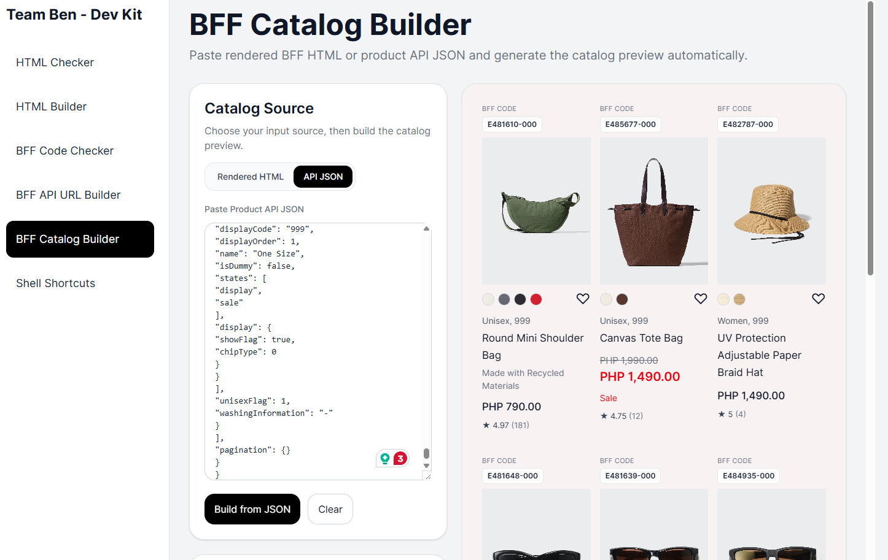

# UNIQLO DEV KIT

A collection of developer tools designed to speed up everyday tasks, including HTML validation and building, BFF code and API URL generation, catalog building, and quick access to useful shell shortcuts.

## Setup Instructions
1. npm install
2. npm run dev
3. Access via: http://localhost:5173

## Modules
 - HTML Checker - Paste  your HTML snippet and check preview.
 - HTML Builder - Paste your HTML code and select CSS files to preview and build complete pages.
 - BFF Code Checker - Extract BFF codes from your text and view them as interactive cards. Supports codes like #123, #456, #789.
 - BFF API URL Builder - Paste product IDs and generate the product API URL automatically.
 - BFF Cataglot Builder - Paste rendered BFF HTML or product API JSON and generate the catalog preview automatically.
 - Shell Shortcuts - Installation guide, commands, and usage notes for your development shell shortcuts.

## Usage
### Steps for using BFF API URL Builder & BFF Cataglog Builder
1. Click BFF API URL Builder, get sample Product IDs paste it on the Product IDs Input. Example: `E481610-000` `E485677-000` `E482787-000` `E481648-000`
2. Click Generate URL
3. Copy URL from Generated API URL (Example: https://www.uniqlo.com/ph/api/commerce/v3/en/products?productIds=E481610-000,E485677-000,E482787-000,E481648-000,E481639-000,E484935-000,E481638-000,E485557-000,E433776-000&isV2Review=true&imageRatio=3x4)
4. Paste it on browser
5. Copy the JSON
6. Click BFF Catagalog Builder > Catagalog Source > API JSON
7. Paste JSON then click Build from JSON and see the BFF preview